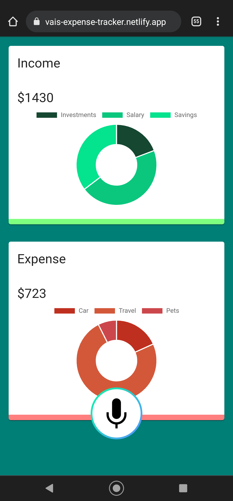

  <a href="" rel="noopener">

<h1 align = 'center'> Expense Tracker with a Voice Feature</h1>

### Screenshots  ##

---
### Description  ##

It is a voice powered budget tracking app created using React, Material UI and Speechify that allows you to add income and expenses across a variety of categories.
The data persists in local storage, and thus, you don't need to worry about authentication or data privacy. It's only limited to your browser.

---

### Deployed expense tracker react app ##
https://vais-expense-tracker.netlify.app/

---

### Getting started ##
  
  Clone the repository and run `npm i` to install all the dependencies 
  Run `npm start` to start the react app 
  Navigate to `localhost:3000` on your browser
